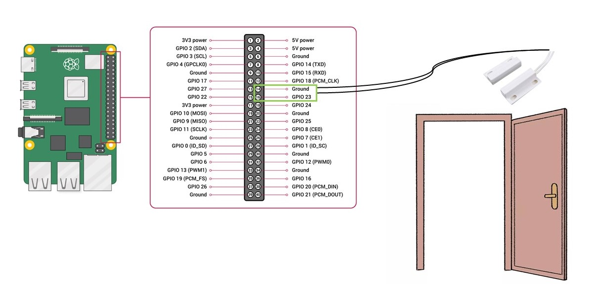

# Melody door 

Home automation program that plays a song from a user-specified playlist whenever the door is opened. This program combines the power of IoT devices and music streaming services to create a delightful and functional experience. It creates a warm and welcoming atmosphere in your home, enhancing the overall experience for you and your guests. You can choose a playlist that sets the mood as soon as the front door opens, whether it's a cheerful tune for your family or a soothing melody for relaxation.

*	Sensor: Magnetic Reed switch / contact sensor installed on the door. When the door is opened, the sensor detects the change and triggers the music playback.
*	Playlist Configuration: The music is chosen from a user-specified Spotify playlist. Spotify Premium account and authentication is required. 

<p align="center"></p>

## Platform
Raspberry Pi  |  Bullseye OS

## Installation

Requires Raspotify - https://github.com/dtcooper/raspotify/tree/master
```sh
sudo apt-get -y install curl && curl -sL https://dtcooper.github.io/raspotify/install.sh | sh
```
Create an app at https://developer.spotify.com/ <br />
Note the redirect URI
## Usage
```sh
python main.py
```
The program runs indefinately, constantly checking if the door is opened. If so, one random song is played from a specified Spotify playlist. <br />
Songs are only played between the hours of 8 a.m. and 11 p.m. <br />
Further music playback can be controlled from Spotify with raspotify set as current device. <br /><br />
Custom values to be modified: 
* Spotify Client ID
* Spotify Client Secret
* Spotify app's redirect URI
* Speaker Device ID 
* Playlist ID 
